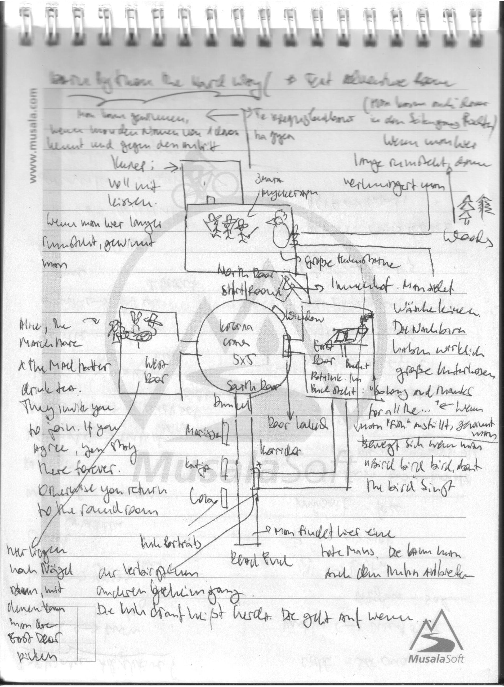

% Get cupcake: Create your own text adventure in python
% meccanica feminale 2023

---

# Day 1 Tuesday 21.2

---

# Get to know the group

---

# Fachlandkarte / Learning Objectives

* text adventures/game jam/fun
* intro to/brush up on python
* intro to git/basics of version controlling
* intro to software projects best practices

---

# Schedule

## Day 1 Tuesday 21.2

## Day 2 Wednesday 22.2

## Day 3 Thursday 23.2

---

# If you want to have the 1 credit point

* Write a report about your project including: 
  * your project map
  * how did you implement key parts of it: What concepts did you learn and where did you apply them (give code examples)
  * what feedback did you get and what did you do with it
  * what else would you like to improve/expand if you had the time

---

# What are your questions?

---

# What are text adventures

Quotes:

> "Interactive fiction"

> "It's like playing a book"

> "The ultimate adventure game cliche is a maze"

Examples
* The classic: Adventure: Cave exploration
* Space Diner: Figure out what to do with weird deliveries, talk to your regulars and try to best match the orders of everyone
* Gender

Ideas/Directions for your project
* mehr Hilfestellung für Spieler\*in vs mehr Exploration
  (fixed set of possible commands previously shared with the player, such as in Monkey Island or Indiana Jones)
* Ideas/Directions to think in: escape game/room; favourite book/movie for story ideas; pen and paper; something you know a lot about

---

# Python Basics

1st worksheet

---

# Python Basics

Hands on

---

## intrepreter/running your script

in the shell:

    $ python <scriptname>

in vscode: play button

interactive intepreter for testing stuff:

    $ ipython

---

# Coding Best Practices

---

## Zen of python

[https://peps.python.org/pep-0020/](https://peps.python.org/pep-0020/
)

---

## Getting help

* Basics lookup: [https://www.pythoncheatsheet.org/cheatsheet](https://www.pythoncheatsheet.org/cheatsheet)
* All the docs: [https://docs.python.org/3.10/reference](https://docs.python.org/3.10/reference)
* Style guide: [https://peps.python.org/pep-0008/#naming-conventions](https://peps.python.org/pep-0008/#naming-conventions)
* General help: [https://stackoverflow.com](https://stackoverflow.com)
* Python concepts explained: [https://realpython.com](https://realpython.com)

---

# Input Python functions

---

# Functions hands-on

* Rewrite the game sofar so it uses functions
* Expand game using functions

---

# 1st steps in git

---

# setup github

* create repo
* create personal access token (or add ssh key)

---

# git/version control systems explained

---

## git cheatsheet

    $ git init .
    $ git add remote origin ...
    $ git branch develop
    $ git checkout develop
    $ git add <file-name>
    $ git commit -m "commit message"
    $ git push origin develop

---

## Map your game

[https://excalidraw.com/](https://excalidraw.com/)

---

# Teams for Peer Reviews for Day 2

---

# Feedback Day 1

---

# Tag 2 22.2

---

Ankommen; Probleme, Anregungen (auch solche vom Parkplatz von gestern klären)

---

# Object oriented programming: What's that

Frage ans Publikum: Wer möchte kurz zusammenfassen was Objektorientierte Programmierung ist?

---

[worksheet]

class Room():
    size = 12
    monster = "bear"
    description = "lalallalala"

    def show(self):
        print(description)

---

Refactor game to use classes

---

pattern matching/regex

---

